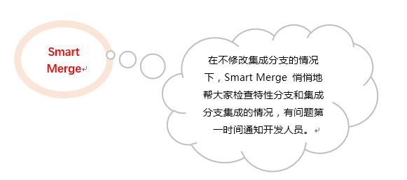
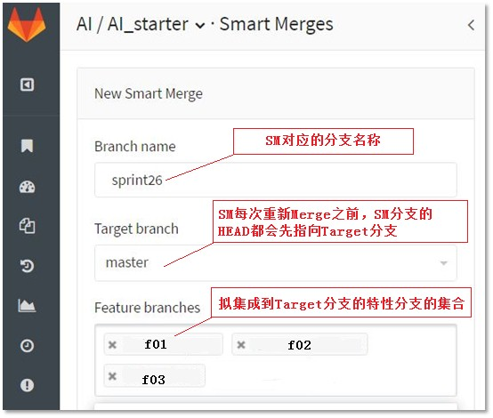

##  综述

本文分析了代码平台提供的集成加速器（Smart Merge，简称SM）产生的背景及其特点，并具体说明了SM在多特性分支上线流程中发挥的作用。SM 给不使用特性开关的项目的集成与上线，提供了一种高效便捷的解决方案。我们期待SM 能为同行的代码集成提供有效的参考，让研发的集成尽可能不那么繁琐，不那么低效。

## 软件研发状况和面临的问题

+ 项目通常有多个功能一起开发，开发的初期为了减少彼此干扰，会为每个功能创建特性分支。
+ 受研发不可控因素的影响，对于未来的某个时间点，多个特性功能存在是否能集成的问题。
+ 各特性分支进入到稳定阶段，必然需要merge在一起，然后一起被编译、打包和测试。怎么让这个过程更加自动化呢？
+ 多个特性分支，难免会修改公用文件，如果不及时关注公共文件的变化，以后各特性分支之间可能出现难merge的情况。

## 典型分支模型

+ 采用特性分支开发模式。
+ 主推的分支模型：
  * master 分支为最核心的集成分支，用于上线。
  * master 分支的任何一个 commit，符合质量要求。
  * 统一从 master 拉取新分支 。  

  
## 单个特性分支怎么合入到 master 分支？

为了保证集成分支的质量，在 gitlab 上集成分支通常都被保护起来（protected），不允许直接 push 到被保护的分支。不过，我们可以通过发起 Merge Request 的方式把特性分支合入到集成分支 。借助 Merge Request，我们可以完成 sonar 静态检查、代码 review 等质量管理的活动。

## 多个特性分支会给集成带来哪些问题？

+	不同分支可能会修改相同文件，集成时很可能出现代码冲突。
+ A、B两个分支先后合入到集成分支，B合入后导致A分支对应的功能发生故障。
+ A 合入到集成分支后可能需要一套测试环境；B 合入到集成分支后也可能再需要一套测试环境。多特性分支分别合入集成分支所需的测试环境也多。

## 靠什么快速发现多特性分支集成的问题？

## Smart Merge 功能及特点

+ 合并冲突自动告警
+ 多分支自动merge
+ 自由选择需集成的特性分支
+ 高效定位可集成的特性分支的最大集合
+ 设置非常简单
+ 支持 CI
+ 与 Merge Request有机结合

## Smart Merge 和 Merge Request 的关系

+ Merge Request 是正式的 merge 请求，在开发的某个时机，用来把一个分支合入到另一个分支。
+ Smart Merge 服务于开发的过程，在不影响任何一个分支的基础上，把>=两个分支做集成，发现冲突及时通知当事人；一旦某个分支发生变化， Smart Merge 立即重新merge、检查并通知。
+ 当它俩在一起工作时，可以大大提升团队集成的效率与质量。

## 多特性分支上线流程（推荐）

说明：
1. F01、F02和F03 三个功能，每个功能对应一个特性分支，并行开发。
2. 三个特性分支的开发人员通过自测后，各自发起了合入到 master 的 merge request。此时，团队可以做code review，sonar静态扫描等检查活动。
3. 于此同时，负责集成的人员借助 Smart Merge，构建、打包并测试后发现F01和 F03的功能集成后可以一起上线，而集成F02 后发现有问题。
4. 最后，F01master 及 F03master 的两个 Merge Request 被接纳，而 F02master的 Merge Request 被拒绝。

上面步骤3在确定哪些特性分支可以一起上线的过程中，就可以借助Smart Merge。代码平台上Smart Merge设置如下图：

如果自动集成时代码发生冲突，则web上会提示冲突，也会Email通知给相关人员。如F01和F02分支修改了同文件的同一行，Smart Merge自动merge后web提示信息如下图：

## 结束语
    
对于不使用特性开关的项目（上线后所有功能都会启用），我们必须保证上线后各个功能正确且有效，这对集成的效率和质量提出较高的要求。
在对多个特性分支做集成的时候，如果不借助Smart Merge类似的工具，负责集成的人员需要做许多繁琐又重复的活动；反之，只需简单的调整需参加集成的特性分支的集合，就能靠Smart Merge自动完成这些特性分支代码的集成、构建、部署，甚至自动化测试，从而筛选出用于上线的特性分支。因此，我们称 Smart Merge 是分支集成的加速器。
